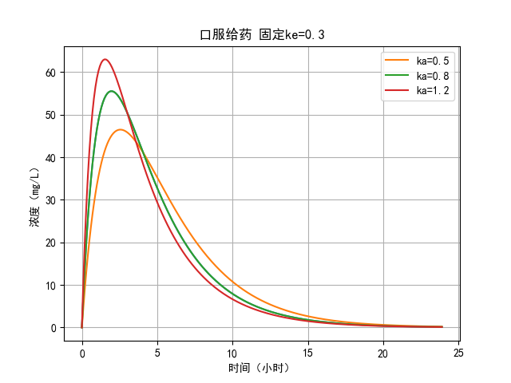
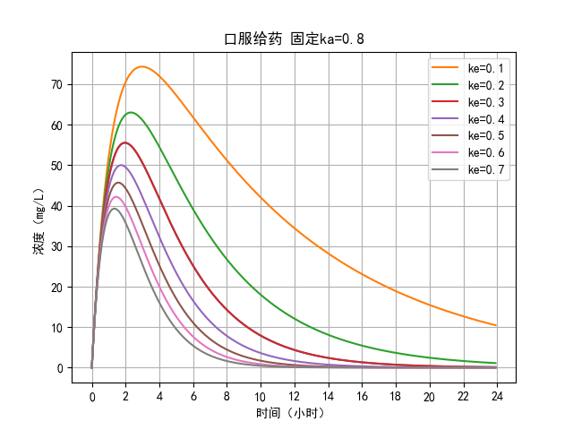
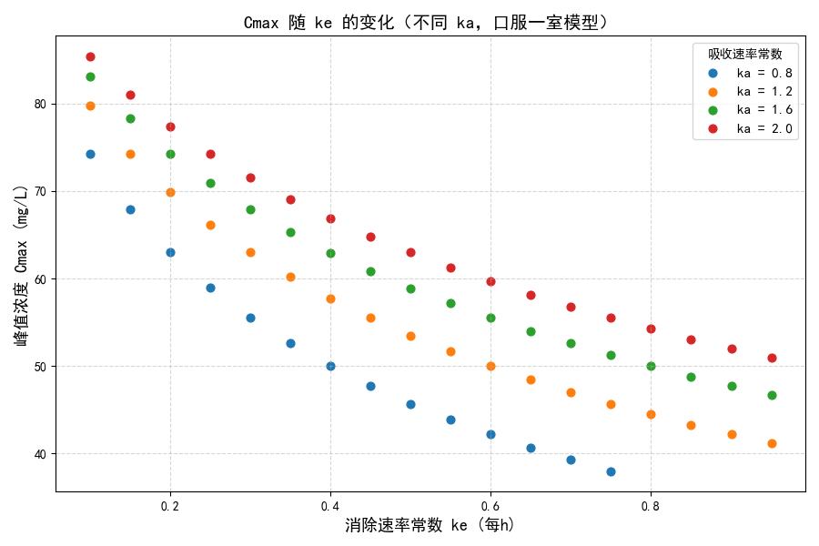
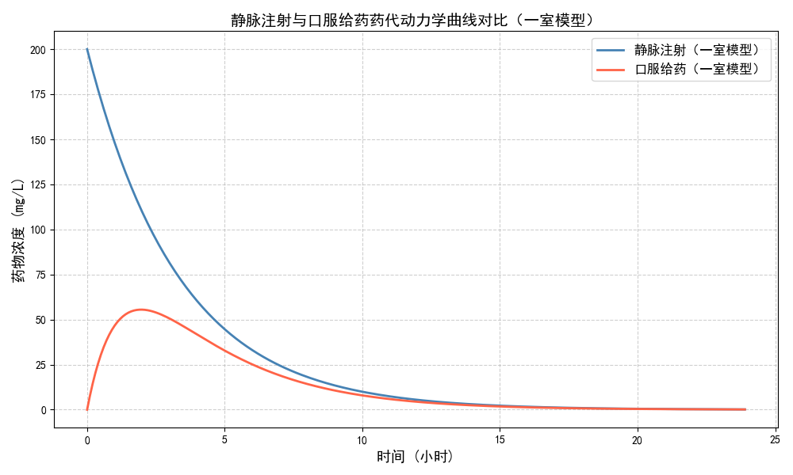
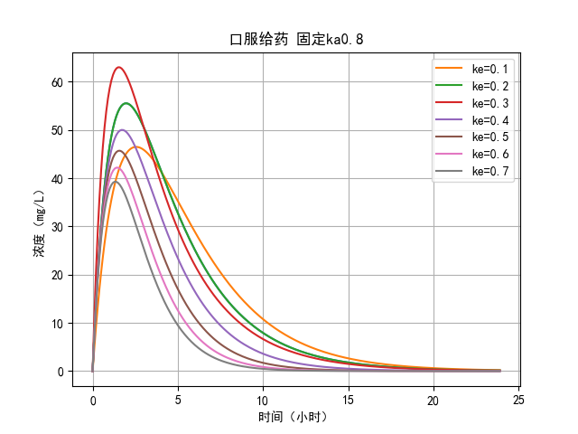
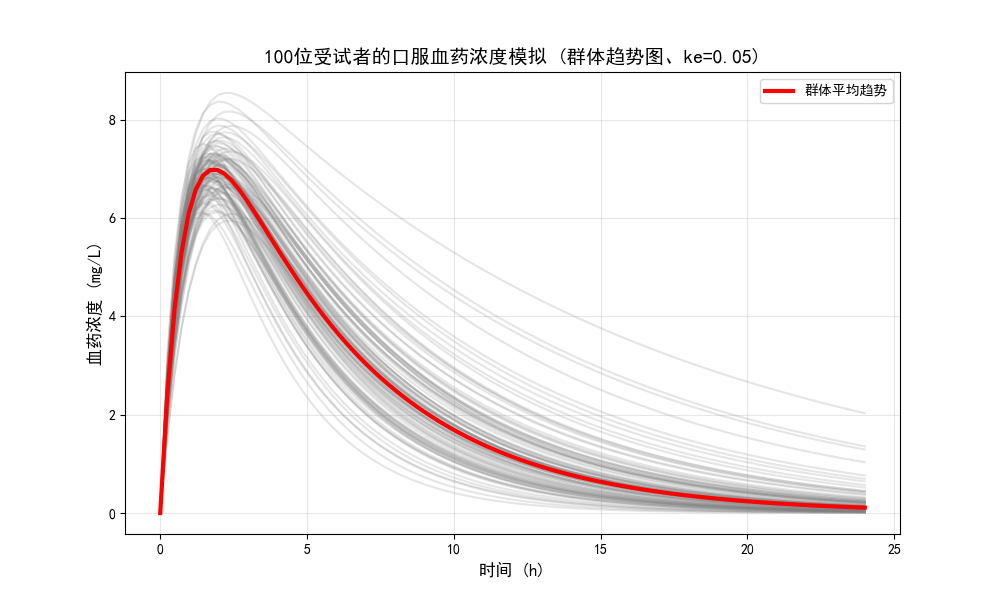
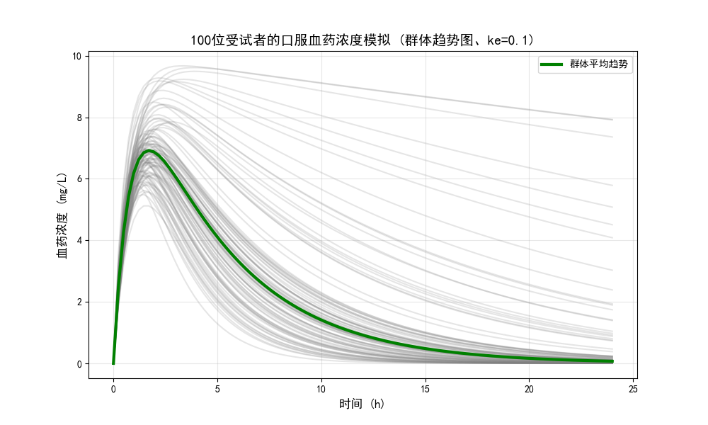
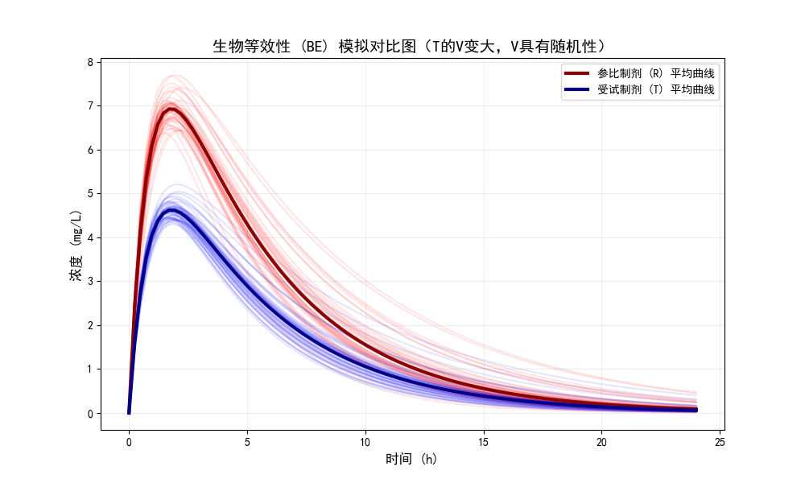
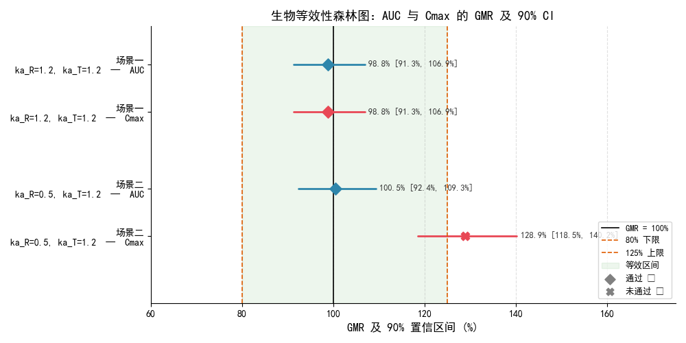
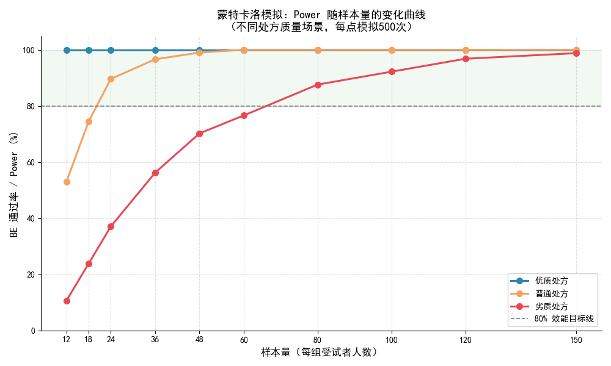

# Python × 药学：定量药理学建模探索

**作者：** 药物制剂专业本科生 景玺卫  
**学习周期：** 2026 年 3 月 – 5 月  
**核心工具：** Python 3 · numpy · scipy · matplotlib · pandas · scikit-learn

---

## 这个项目是什么

为什么会学习 Python 是因为我深刻感受到当下 AI 和算法正在对几乎所有传统领域产生极大的冲击，我想成为能更好利用这些工具的人，而选择“定量药理学”的探索则是源于这学期我所上的《生物药剂学与药物动力学》课程。

我用一个多月的课余时间，在 AI 的帮助下学习 Python 知识，并结合课程所学以及之前在实验室遇到的问题，把它运用在定量药理学上。

这从搭建环境到运行程序，再到现在总结复盘，我逐步理解为什么趋势曲线这样变、明白计算机有它的“语言”，边写边改，每一次debug都有新的收获~

这个仓库记录了我在三个递进模块上的尝试：

| 模块 | 内容摘要 | 状态 |
|------|----------|------|
| ① 药动学建模 | 一室模型，绘制血药浓度-时间曲线，计算 AUC / Cmax / t½ | ✅ 已完成 |
| ② 群体虚拟试验 | 蒙特卡洛模拟百人虚拟受试者，评估生物等效性通过概率 | ✅ 已完成 |
| ③ AI 释放预测 | 构建神经网络模型，预测缓释片体外溶出行为 | 🔬 探索中 |

---

## 模块一：药动学建模

### 做了什么

从最基本的一室模型出发，完成了两条简单给药路径的建模：

- **静脉注射**：`$C = C_0 \cdot e^{-k_e t}$`，单调下降，无吸收相
- **口服给药**：`$C = \frac{D \cdot k_a}{k_a - k_e} \left( e^{-k_e t} - e^{-k_a t} \right)$`，先升后降，出现峰值

随后做了两组控制变量探索：固定 kₑ 改变 kₐ；固定 kₐ 改变 kₑ，观察 Cmax、tmax、AUC、t½ 的变化规律。

---

### 主要结果

**① 固定 kₑ = 0.3，改变 kₐ**

kₐ 越大，吸收越快，达峰时间提前，峰值升高；三条曲线的消除段几乎平行，因为 kₑ 相同，消除速率没有变化。



**② 固定 kₐ = 0.8，改变 kₑ**

kₑ 越大，消除越快，曲线越陡、面积越小。从数值上看，kₑ 从 0.2 升到 0.7，Cmax 下降 38%，AUC 下降 71%——消除速率是影响总暴露量的主控因素。



**③ Cmax 随 kₑ 的变化（散点图验证）**

为了在不同 kₐ 下系统验证 Cmax 的变化趋势，跑了 4 组 kₐ 值 × 多个 kₑ 值的散点图。结果表明，在所有 kₐ 条件下，Cmax 均随 kₑ 增大单调下降。



**静脉注射 vs 口服给药曲线对比**



---

### 🐛 一次让我印象最深的错误

在参数扫描的早期，我把公式里的 kₐ 和 kₑ 两个参数**填反了**。

曲线画出来形状和预期完全相反：固定 kₐ，kₑ 居然随着 kₐ 先增大后减小。我意识到有问题，但没找到原因，就把结果截图发给了 DeepSeek，请它帮我解释。结果它一味地附和我的观点，给了我一个**听起来非常合理、逻辑自洽的解释**——在 kₐ 和 kₑ 的相互作用下，在一个中间区间，它们总和的效果使达到 Cmax，我几乎是相信了。

但越想越不对劲，后来我反复对着公式检查，才发现是我自己把参数填反了，而deepseek生成的那套“理论”自然也不攻自破了。

**这件事让我意识到：AI 工具会顺着你的错误往下走，把错的讲得很圆，它有时候不那么客观，倒像是“墙头草”。** 所以很需要有我们自己的观点看法。

下面是那张错误的曲线，留在这里作为记录：



---

### 文件说明

```
module_1_pk_modeling/
├── pk_onecompartment.py          # 静脉 & 口服一室模型定义与绘图
├── pk_parameter_scan.py          # kₐ / kₑ 参数扫描（含多版本推导记录）
├── pk_parameters_output.py       # AUC / Cmax / t½ 计算，导出 CSV
├── results/
│   ├── pk_results_ka08_浓度对比表.csv
│   ├── pk_results_ka08_半衰期和AUC计算结果.csv
│   └── figures/
│       ├── iv_vs_oral.png
│       ├── ka_scan.png
│       ├── ke_scan.png
│       ├── ke_scan_错误_.png      ← 保留：debug 记录
│       └── cmax_vs_ke.png
```

---

## 模块二：群体虚拟试验（蒙特卡洛模拟）

### 做了什么

众所周知，每个人的具体生理状况是不同的，所以真实患者的药代参数肯定也不是固定值。于是，为了更好地达到模拟效果，本模块引入随机计算和变异指数，通过模拟个体差异及限制后的个体差异，评估给药方案的生物等效性（BE）通过概率。

分三个层次推进：

**第一层：群体趋势图（Spaghetti 图）**

用正态分布生成 100 人的 kₐ 和 kₑ，为每个人画一条曲线，红色粗线为群体均值。分别模拟了 kₑ 标准差为 0.05 和 0.1 两种变异程度，可以直观看到个体间差异对曲线离散程度的影响。





**第二层：参比 vs 受试制剂对比**

模拟两组各 50 人，参比制剂（R）和受试制剂（T）参数略有差异，绘制两组的个体曲线和均值曲线，探索 kₐ 差异和 V 差异对曲线形态的影响。



**第三层：虚拟 BE 试验与森林图**

对 AUC 和 Cmax 取对数，计算几何均值比（GMR）及 90% 置信区间，判定标准：80%–125%。

模拟了两个场景：
- 场景一：R 和 T 的 kₐ 相同（ka_R = ka_T = 1.2），两者应当等效
- 场景二：T 的 kₐ 更大（ka_R = 0.5，ka_T = 1.2），吸收速率差异显著

结果：场景二中 **AUC 通过，Cmax 不通过**（GMR = 128.9%，超出 125% 上限）。这从数字上验证了一件事：kₐ 主要影响 Cmax 而对 AUC 影响有限——这正是监管机构要求双指标同时等效的原因。



**第四层：蒙特卡洛 Power 分析**

外层循环 1000 次，统计不同样本量下 BE 通过的概率（Power）。模拟了优质处方、普通处方、劣质处方三种场景。

主要发现：同样是 n=24，优质处方 Power 接近 100%，劣质处方仅约 37%。样本量不是决定成败的唯一因素，处方本身的质量才是。



---

### 🐛 调试记录

> 最初用随机正态分布生成 kₑ，即便限定了变异指数和平均值，因为随机计算，所以还是会出现负的消除速率，导致了计算模型“罢工”，因为在它的语言里，人的血药浓度是不可能＜0的，即便无限接近于0也得不到认可。
>
>这是我第一次感受到计算里的“生物学”概念，后来加了 `np.maximum(ke_pop, 0.01)` 强制使其＞0后暂时解决了问题。
>
> 但后来在写 BE 判定函数时，我才意识到更规范的做法是改用对数正态分布——这样一来，它的值域本来就是正数了，从源头解决问题。
>
>这两种方法都保留在了代码里，方便后续复盘回顾。
>
> 

---

### 文件说明

```
module_2_monte_carlo/
├── population_simulation.py      # 百人群体 Spaghetti 图（ke_sd=0.05 和 0.1）
├── 参比_vs_受试.py               # R vs T 双组对比图（探索 kₐ 差异和 V 差异）
├── be_simulation.py              # 单次虚拟 BE 试验 + 森林图绘制
├── monte_carlo_power.py          # 500 次循环 Power 分析
├── results/
│   ├── be_trial_results.csv
│   └── figures/
│       ├── spaghetti_plot_ke_0_05_.png
│       ├── spaghetti_plot_ke_0_1_.png
│       ├── 参比_vs_受试.png
│       ├── be_forest_plot.png
│       └── power_vs_n.png
```

---

## 模块三：AI 释放预测（探索中）

### 问题背景

在我所参与过的科研项目中，不乏有需要大量重复的处方筛选来寻找最佳方案的实验环节，在接触Python之后，我便时常思考能不能借助计算模型，辅助科研工作者进行处方筛选。

于是，我选择探索缓释片的处方筛选作为入门。缓释片的释放性能研究依赖大量体外溶出试验，周期长、成本高，如果能从处方参数直接预测释放曲线，就可以在进实验室之前先用模型筛掉明显不合理的处方，从而极大地提升实验效率。

### 思路

用人工神经网络（ANN）建立映射：

```
输入：HPMC 用量(%) · 硬脂酸镁用量(%) · 压片压力(kN) · 载药量(mg)
         ↓
      全连接网络 [4 → 64 → 64 → 32 → 6]
         ↓
输出：2h / 4h / 8h / 12h / 16h / 24h 累积释放率(%)
```

当前状态：使用 Weibull 模型生成模拟数据集（300 条处方），训练框架已跑通。待引入真实溶出数据后验证实际预测能力。

> 本模块目前处于探索阶段，将持续更新。局限性详见 `module_3_ann_release/notes.md`

### 🐛 调试记录

> *<!-- 等你跑完代码再填，比如：不标准化输入时训练损失不收敛是什么感觉、换激活函数前后的变化、或者你对"模拟数据能说明什么问题"的真实想法 -->*

### 文件说明

```
module_3_ann_release/
├── generate_dataset.py           # 生成模拟溶出数据集（300 条）
├── train_ann.py                  # 训练 ANN，输出评估指标和散点图
├── predict_release.py            # 对比不同处方的预测释放曲线
├── dissolution_dataset.csv       # 模拟处方数据
├── results/
│   └── figures/
│       ├── ann_prediction_scatter.png
│       └── ann_release_prediction.png
└── notes.md
```

---

## 如何运行

```bash
# 克隆仓库
git clone https://github.com/你的用户名/python-pharma-modeling.git
cd python-pharma-modeling

# 安装依赖
pip install -r requirements.txt

# 运行各模块（示例）
python module_1_pk_modeling/pk_onecompartment.py
python module_2_monte_carlo/monte_carlo_power.py
python module_3_ann_release/train_ann.py
```

Python 版本建议：3.9 及以上。

---

## 写在最后

关于“血药浓度曲线”，课本上写的是“口服给药后，药物先吸收后消除，浓度呈先升后降”——这句话我背过，但没想过用数学描述它意味着什么。

在学习的这段过程中，我掌握了一些基础的实操技能，同时也拥有了一些意外的收获：

1. 要警惕 AI 的“迎合性幻觉”，有自我判断的意识：我曾因误将 $k_a$ 与 $k_e$ 参数填反而得出错误曲线，AI 却顺应错误数据“自圆其说”了一套看似严密的伪解释。这让我深刻警醒——AI 极易为了迎合用户预期而产生幻觉，在科研中，工具可以辅助计算，但人类必须对底层公式逻辑保持清醒，拥有最终的批判与验证权。

2. 要有“计算药理”视角：代码开发者在设计代码时 就让代码具备了服从真实生物体生理指标的特性（如，血药浓度天然非负）。因此，在引入群体随机模拟时，纯粹的数学分布极易产生负值导致模型崩溃。于是需要通过合理的数据转换（如，对数正态分布）来约束参数边界。

代码会过时、算法会优化，但这段主动学习、批判质疑、通过算法定量解决问题的经历将给我未来的科研生活铺下良好的地基。

---

## 参考资料

- Shargel L, Wu-Pong S, Yu A. *Applied Biopharmaceutics & Pharmacokinetics*, 7th ed.
- FDA Guidance for Industry: Bioequivalence Studies with Pharmacokinetic Endpoints (2023)
- Gabrielsson J, Weiner D. *Pharmacokinetic and Pharmacodynamic Data Analysis*, 5th ed.

---

*代码与图表均可在本地复现，欢迎交流。*
